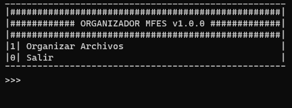

# Organizador MFES with Python
---
## Description
This script is designed to organize your files by the file extension of each one.
The script first creates the folders where the files will be saved.
It then loops through each file and moves it to the corresponding destination folder.

## Screenshot


## Script Version
Organizador MFES `v1.0.0`

## Libraries
You just need the **"os"** library which is already integrated with python.
```python
import os
```

## Python Version
Made in `Python v3.11.1`